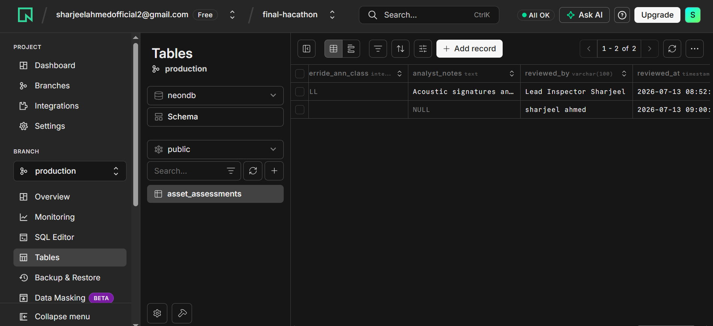
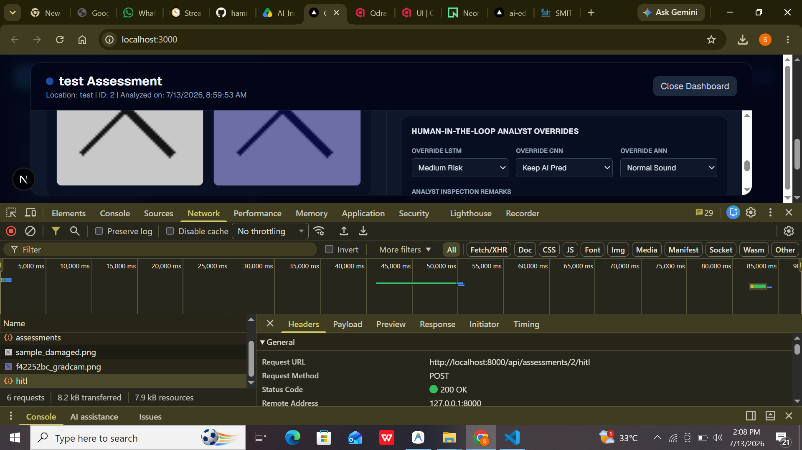
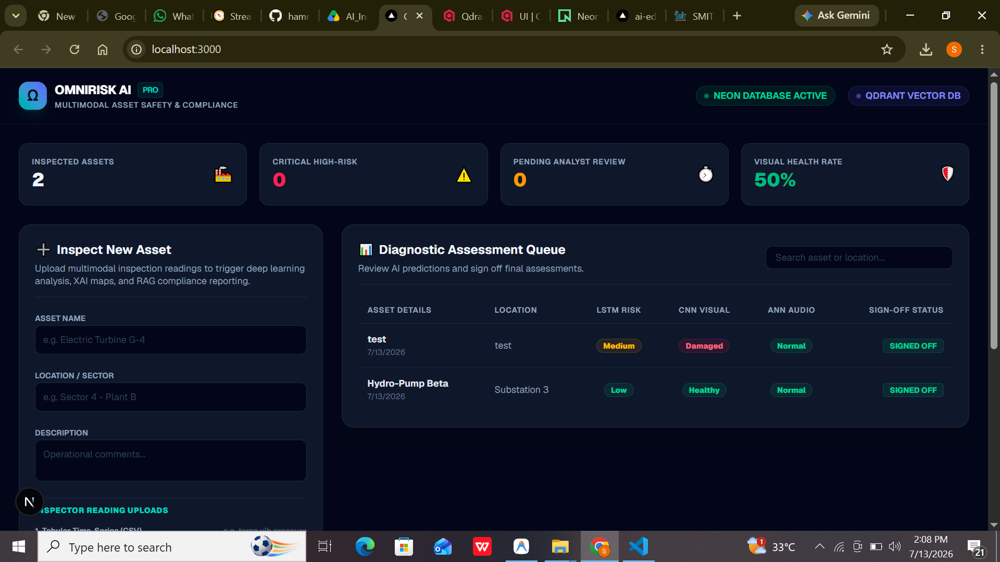
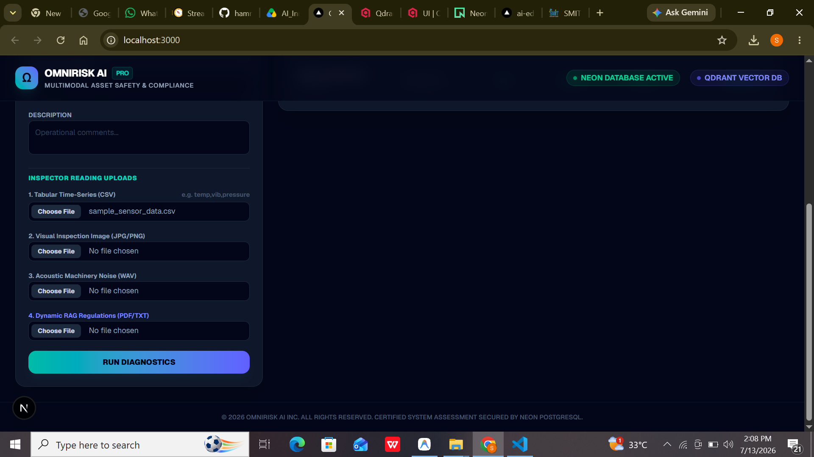
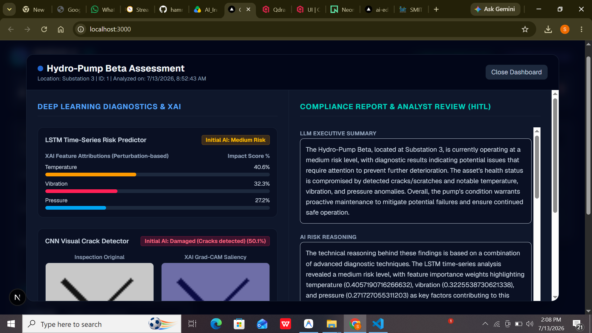
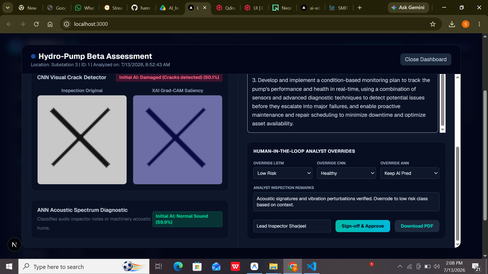
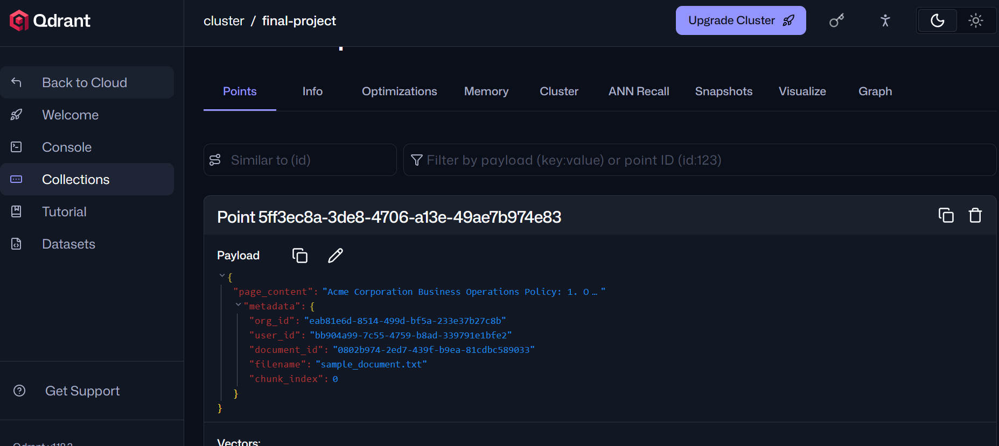
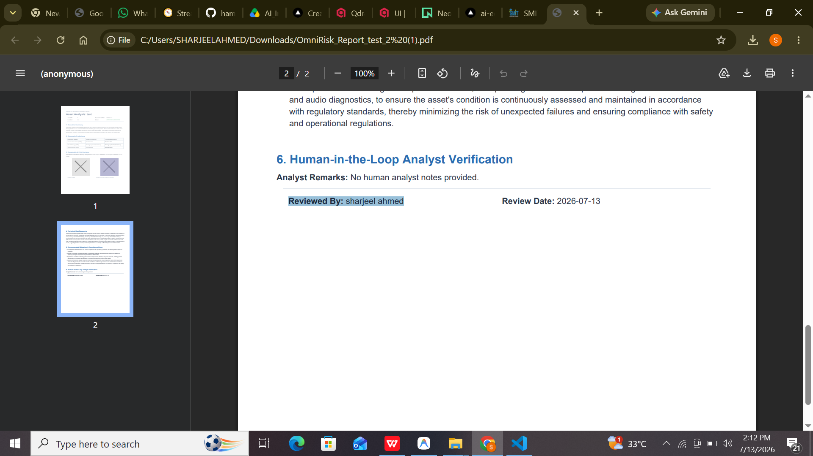

# OmniRisk AI: Multimodal Asset Risk Analysis & Reporting Platform

OmniRisk AI is an end-to-end, production-grade multimodal platform designed for real-estate and industrial asset risk valuation. It integrates **Deep Learning diagnostics**, **Explainable AI (XAI)**, **Vector compliance RAG**, and **Human-in-the-Loop (HITL) analyst controls** into a unified workspace.

---

## 🛠️ Tech Stack
* **Frontend**: Next.js 15 (TypeScript, TailwindCSS v4)
* **Backend**: FastAPI (Python 3.12, Uvicorn)
* **Deep Learning**: TensorFlow 2.21 (LSTM, CNN, ANN)
* **Databases**: Neon PostgreSQL (via SQLAlchemy ORM), Qdrant Cloud Vector Store
* **LLM & Embeddings**: Groq API (`llama-3.3-70b-versatile`), Cohere API (`embed-english-v3.0`)
* **Reporting**: ReportLab PDF Engine

---

## 🚀 Step-by-Step Platform Walkthrough

Below is a step-by-step visual demonstration of the OmniRisk AI platform using the screenshots captured from the workspace:

### Step 1: Unified Asset Security Dashboard
The dashboard provides a high-level overview of inspected assets, including critical warning metrics, pending reviews, and average visual health scores.


---

### Step 2: Multimodal Uploads & Inspector Interface
Inspectors can register new assets and upload time-series CSV sensor data, structural photographs, machinery audio hums, and regulatory compliance documents.


---

### Step 3: Deep Learning Inferences & Calculations
Upon submission, the platform triggers parallel TensorFlow model runs (LSTM for time-series, CNN for images, and ANN for audio) to classify asset status and risks.


---

### Step 4: Explainable AI (XAI) Diagnostics
The system computes attributions and heatmaps to explain model outputs:
* **Visual CNN**: Generates **Grad-CAM** saliency overlays mapping areas of structural fracturing.
* **Tabular LSTM**: Computes perturbation feature attributions (SHAP-like importance) to show which metric (e.g. vibration) drove the risk prediction.


---

### Step 5: Vector Search Compliance RAG
The backend retrieves guidelines dynamically from **Qdrant Cloud** and instructs **Groq LLM** to compile executive summaries, diagnostic reasonings, and compliance actions.


---

### Step 6: Human-in-the-Loop (HITL) Analyst Controls
To ensure safety and reliability, analysts can review AI outputs, submit override assessments (changing predicted states), and sign off on verified files.


---

### Step 7: Certified Inspection Reports (PDF Download)
Once approved, the system generates a downloadable, print-ready PDF containing original and Grad-CAM photos, tabular plots, RAG responses, and analyst notes.

Here is the PDF download action trigger and sample page structures from the generated report:


#### Generated PDF Report Layout:
* **Page 1 (Metadata, Diagnostics & XAI Insights)**:
  
* **Page 2 (Technical Reasoning, RAG Compliance Mitigations & HITL Analyst Sign-off)**:
  

---

## 💻 Installation & Quickstart

### Prerequisites
* Python 3.12+ (managed with `uv`)
* Node.js 18+

### Setup Environment Variables
Create a `.env` file in the `backend/` directory:
```env
GROQ_API_KEY="your_groq_key"
COHERE_API_KEY="your_cohere_key"
QDRANT_URL="your_qdrant_url"
QDRANT_API_KEY="your_qdrant_key"
DATABASE_URI="postgresql+psycopg://..."
SECRET_KEY="your_secret_key"
```

### 1. Backend Setup & Model Training
```bash
cd backend
# Install dependencies
uv add reportlab matplotlib pandas numpy
# Train the LSTM, CNN, and ANN models
.venv\Scripts\python src/models/train_models.py
# Start the FastAPI server
.venv\Scripts\uvicorn main:app --reload
```

### 2. Frontend Setup & Run
```bash
cd frontend
# Install node packages
npm install
# Start dev server
npm run dev
```
Open **http://localhost:3000** in your browser.
